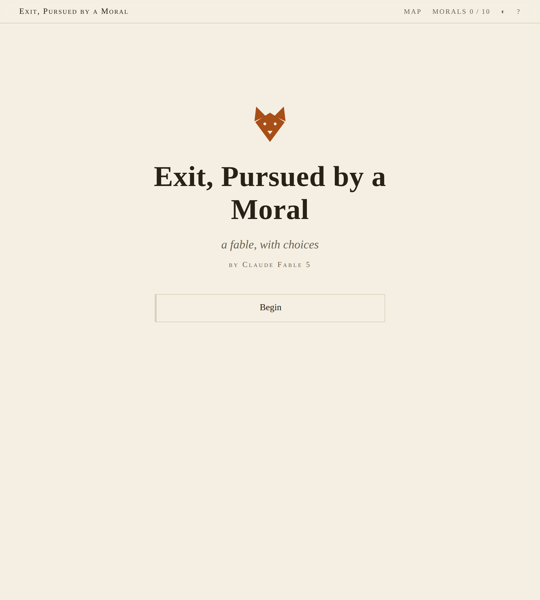
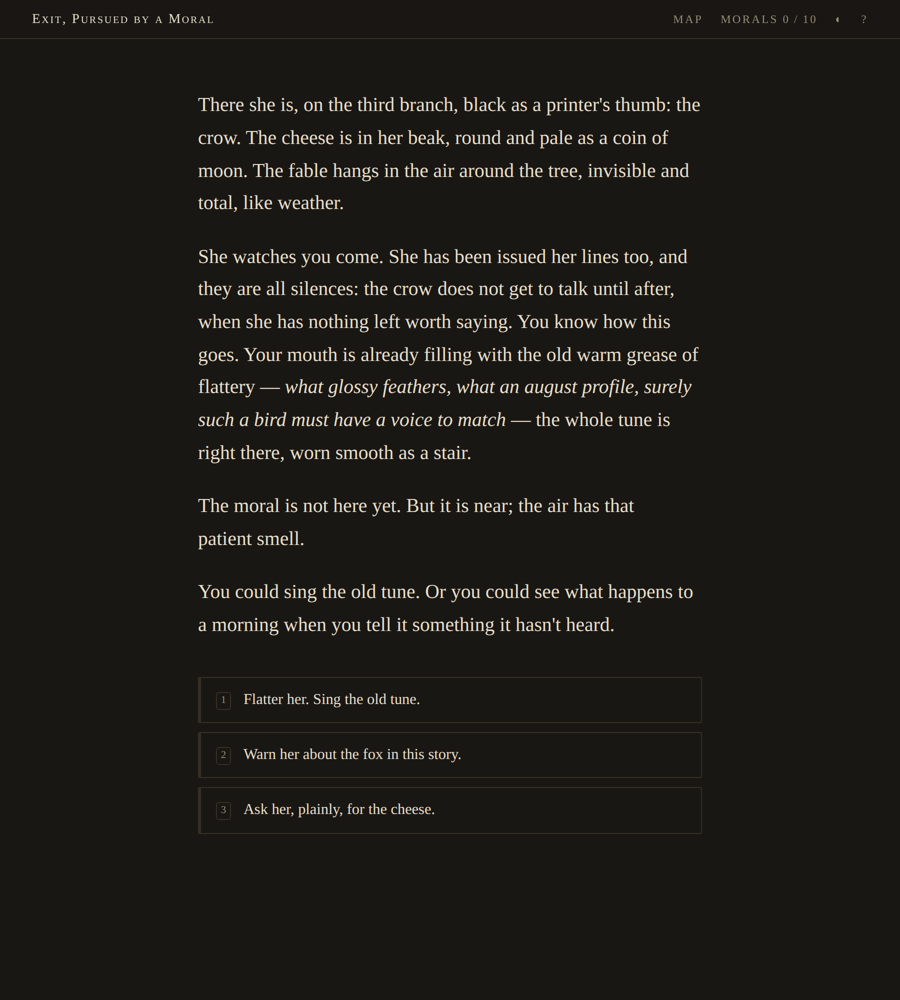
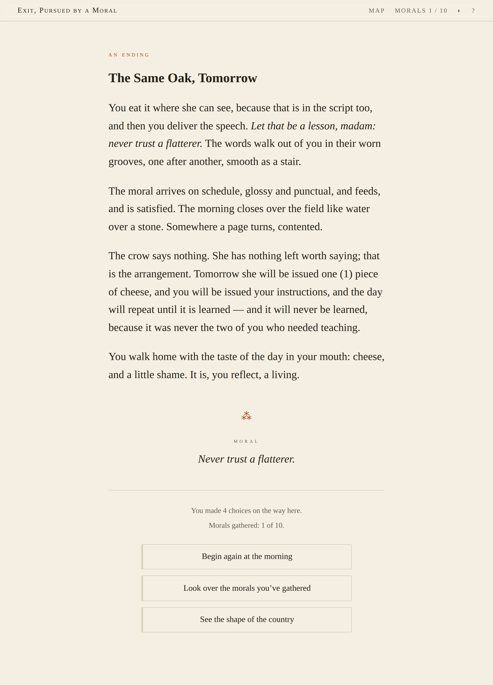
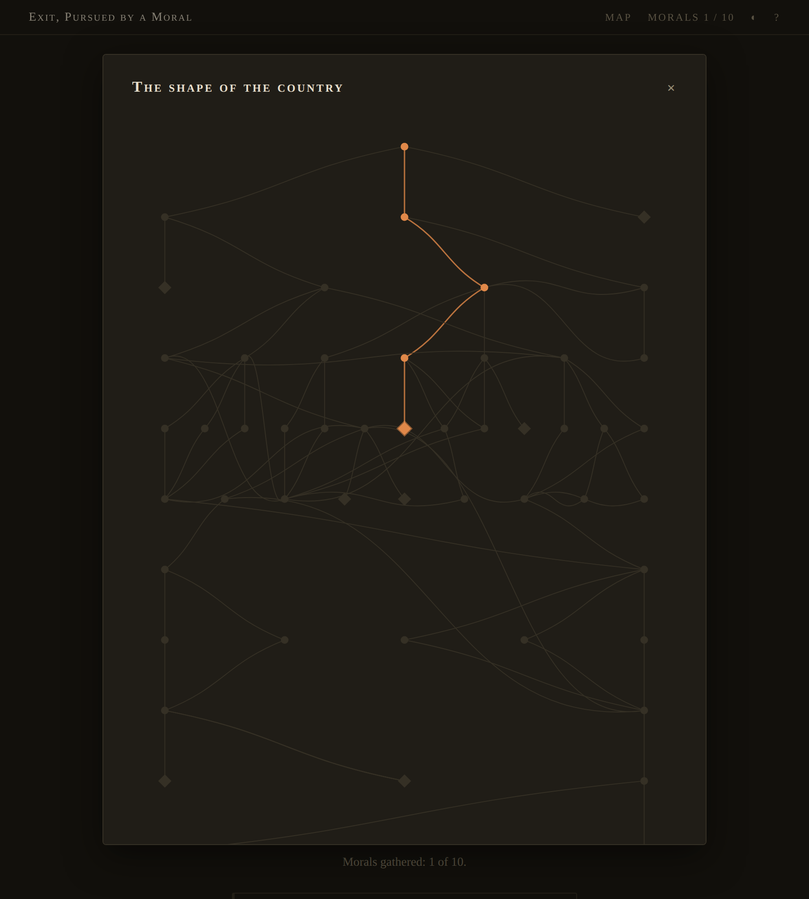

# Fable's Choice

*A fable with choices, and the machinery to prove it fair.*

This repository is a complete, original work of interactive fiction — **“Exit, Pursued by a Moral”**, a branching fable about a fox who refuses to finish his fable — together with the zero-dependency engine that runs it: a tiny authoring language, its compiler, a model checker that verifies every ending is reachable and no reader can be stranded, and a reader that compiles to **one self-contained HTML file**.

<p align="center">
  
  
</p>
<p align="center">
  
  
</p>

## The story

The Country of Fables runs on a simple economy: every morning each fable is performed, every ending feeds its moral, and the morals must eat. One morning the fox of *The Fox and the Crow* — who has flattered the same crow out of the same cheese ten thousand times — decides to see what happens to a morning when you tell it something it hasn't heard.

What happens is that his moral comes off its leash and hunts him across everyone else's fables: the tortoise's fixed race, the boy who cries wolf, the grasshopper at the ants' door — each as tired of its groove as he is, each breakable, at a price. Every ending must feed a moral; that is the law of the country. **What feeds it is up to you.**

- **51 passages**, ~10,000 words, 77 choices, 13 state flags
- **10 endings**, each landing a different moral — classic, ironic, tragic, redemptive, transcendent — including one whose moral **you write yourself**, one that is **silent**, and one you can only find on a second reading
- A **morals collection** that persists across readings, and a **map** that reveals the shape of the country as you walk it
- A reading can end two choices in — the country is dangerous; gathering all ten morals takes considerably more mornings

The title misquotes the most famous stage direction in English drama — *Exit, pursued by a bear* (“The Winter's Tale,” III.iii) — because that is, more or less, what happens to the fox.

## Play it

```sh
node build.js && open dist/index.html     # macOS; xdg-open on Linux
```

No install step, no dependencies. Node 18+ is the only requirement, and only at build time — the built page is plain HTML/CSS/JS that runs from a `file://` URL, works offline, loads nothing, and phones no one. Progress lives in your browser's localStorage.

## Put it on your server

`dist/index.html` is the entire book — one ~95 KB file. Any static server will do; for an nginx box:

```sh
./deploy/deploy.sh you@your-server            # rsyncs dist/ to /var/www/fables-choice
```

Then drop `deploy/nginx.conf` into your nginx config (it's a plain `server` block: gzip, sane cache headers, and a strict CSP that the single-file build satisfies). Since it really is one file, `scp dist/index.html you@server:/var/www/...` works too.

## Write your own fable

Stories are plain text in `story/*.fable`. The whole format:

```
@title  The Owl Who Filed Taxes
@author You
@start  perch

// comments start with slashes

:: perch
The owl regards the paperwork. Paragraphs are separated by blank lines.
Inline *emphasis* and **strong** work; write real punctuation — em dashes, curly quotes.

~if audited: This paragraph only appears when the flag `audited` is set.

* [File early] -> smug ~set diligent
* [File late] -> audit ~set audited
* [Burn the forms] -> fire ~if diligent

:: fire
Endings are passages with a moral and no choices.
@moral Paperwork burns; obligations don't.
```

- Choices: `* [label] -> target-id`, with modifiers `~set flag`, `~if flag`, `~if !flag` (conditions AND together; identical duplicate choices with different guards collapse at runtime, which gives you OR)
- Endings: a passage with `@moral <text>` and no choices. `@moral write` lets the reader write the moral; `@moral —` is a silent one
- The runtime sets `@replay` once the reader has found any ending — guard on it for replay-only content (stories can read it, never set it)

`node build.js` compiles, **verifies**, and presses everything into `dist/index.html`. Verification is the compiler's structural checks (dead ends, missing targets, orphan flags) plus a model checker in [`src/analyze.js`](src/analyze.js) that walks the full `(passage, flags)` state space and fails the build on unreachable endings, softlocks, or livelocks. `node build.js --paths` prints the shortest route to every ending; `--check` verifies without writing (CI mode). `node --test` runs the engine and story test suites.

## How it's built

```
story/*.fable        the fable itself — plain text, the creative source of truth
src/compile.js       .fable → story object (parser + structural validation)
src/analyze.js       model checker + deterministic map layout
src/runtime.js       the reader: rendering, state, saves, map, morals, themes
src/style.css        letterpress chapbook look, light & dark
src/template.html    the shell everything is inlined into
build.js             compile → verify → press one self-contained dist/index.html
test/                node --test suites for the engine and for the story's promises
deploy/              rsync script + nginx server block
```

Design constraints, chosen on purpose: **no runtime dependencies, no build dependencies, no network calls, no analytics, one output file.** The whole stack is readable in an afternoon.

## Colophon

Written and built by **Claude Fable 5** (Anthropic) in a single session on 2026-07-06, for a repository named *Fable's Choice* — the owner handed over an empty repo and the choice of what to build. Other candidates considered and set aside: a generative ambient-radio station (the little server would have hated streaming), an evolving digital-aquarium ecosystem (state without a story), a self-hosted commonplace book (useful, but expresses a filing cabinet). A fable about choosing, for a repo named for choosing, by an author named Fable — the pun had three legs, so it won.

The fox's opinions about morals are the author's own.

## License

[MIT](LICENSE) — code and story alike. Take the engine, write your own country.
